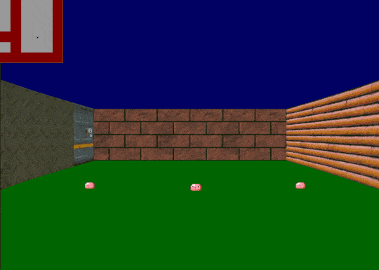

# Cub3D

This project is a wolfenstein-like little program coded in C using raycasting. No game engine was used.

## Raycasting ? What's that ?
Raycasting is a technique used in computer graphics to create a 3D-like perspective in a 2D game world. Imagine you are standing in a maze and you shine a flashlight straight ahead. The light beam is like a "ray" that travels until it hits a wall.

In raycasting, the game sends out many rays from the player's position, one for each column of pixels on the screen. Each ray moves forward until it hits an obstacle, like a wall. The distance each ray travels determines how tall the wall appears on the screen, creating the illusion of depth. Closer walls look taller, and farther walls look shorter.

Raycasting is efficient because it only calculates the visible walls and ignores everything else, making it a popular choice for early 3D games like "Wolfenstein 3D."

## Features

- Loads any `.cub` map complying with subject's rules (several examples can be found in `./maps` directory)
- Handles different colors for floor and ceiling, and different textures for walls according to their orientation. Wall textures can be ugly and inconsistent as can be seen on the animation above.
- Handles animated sprites. Pink slimes are the best option, especially when they leave a permanent mark at the bottom of the compressed animated gif you made for your repo to look nice. 🙃

## Getting Started (linux)

1. Clone the repository: `git clone https://github.com/tgrasset/cub3d.git`
2. Navigate to the project directory: `cd cub3d`
3. Compile : `make`
4. Start : `./cub3d <path/to/map/file.cub>`

## Usage

- Look around with left and right arrows
- Move forward with up arrow or `W`
- Move backward with down arrow or `S`
- Move sideways with `A` and `D`
- Quit with `Escape`

There isn't much to do besides moving around, this is not a proper game, but just a simple raycasting experimentation.

## Acknowledgements

This project was made with my teammate [hejingar](https://github.com/hejingar)
 at 42 school in April 2023.